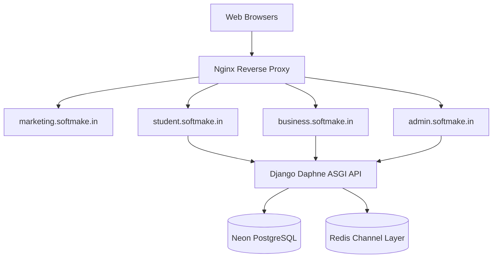

# System Architecture Documentation

This monorepo layout separates concerns by splitting the user portal layers from backend APIs and isolating integrations into discrete packages.

## Shared Packages (`packages/`)
- `@softmade/ui`: Shared React components (button, card, badge, progress, separator) built with Radix UI and Tailwind CSS v4.
- `@softmade/types`: Shared TypeScript interfaces representing models and API payloads.
- `@softmade/utils`: Common utility functions.

## Backend Modularity (`apps/backend/apps/`)
Django apps are decoupled and reference each other using lazy model strings rather than absolute imports to avoid circular reference loops:
- `accounts`: Authentication database tables and views.
- `students`: Student details, credentials, profile links.
- `projects`: Project stage trackers and repository links.
- `tickets`: Technical support tickets, dynamic ticket message rows, and custom WebSocket chat channels.
- `payments`: Payments log and balance status updates.
